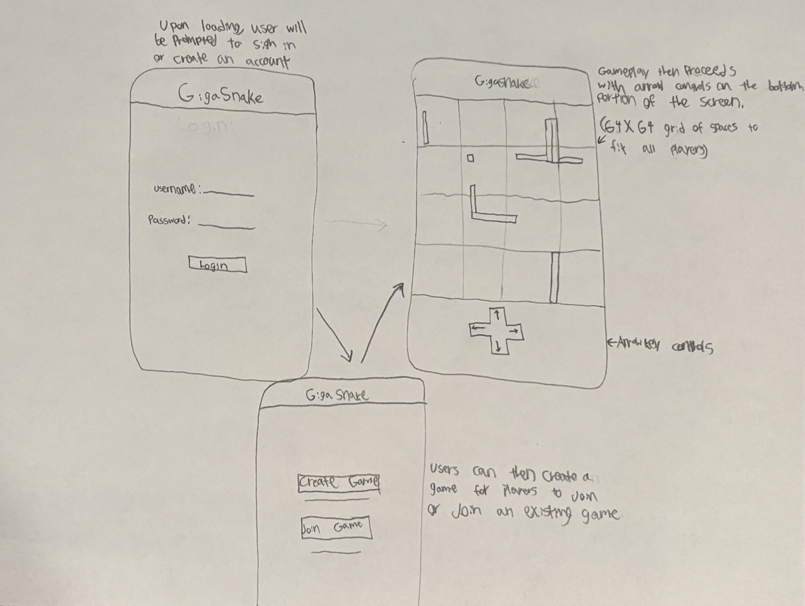

# GigaSnake

[My Notes](notes.md)

A competitive game, based on classic Snake, where each player controls a snake and wins by becoming the largest before elimination. Snakes grow by colliding with randomly appearing fruit. Elimination happens if a snake collides with itself, a wall, or another snake.

> [!NOTE]
>  This is a template for your startup application. You must modify this `README.md` file for each phase of your development. You only need to fill in the section for each deliverable when that deliverable is submitted in Canvas. Without completing the section for a deliverable, the TA will not know what to look for when grading your submission. Feel free to add additional information to each deliverable description, but make sure you at least have the list of rubric items and a description of what you did for each item.

> [!NOTE]
>  If you are not familiar with Markdown then you should review the [documentation](https://docs.github.com/en/get-started/writing-on-github/getting-started-with-writing-and-formatting-on-github/basic-writing-and-formatting-syntax) before continuing.

## 🚀 Specification Deliverable

> [!NOTE]
>  Fill in this sections as the submission artifact for this deliverable. You can refer to this [example](https://github.com/webprogramming260/startup-example/blob/main/README.md) for inspiration.

For this deliverable I did the following. I checked the box `[x]` and added a description for things I completed.

- [x] Proper use of Markdown
- [x] A concise and compelling elevator pitch
- [x] Description of key features
- [x] Description of how you will use each technology
- [x] One or more rough sketches of your application. Images must be embedded in this file using Markdown image references.

### Elevator pitch

Based on the classis video game Snake, GigaSnake is an online multiplayer game where each player is competing to get the largest snake before death. Each player in a game will be playing on the same board. Collision with the edges of the board or a snake (including one's own snake) will cause a death. A player's score upon death is how long the snake grew, and therefore how much fruit it ate. Players will need to create an account so their high scores can be recorded.

### Design

### Key features

- Users will be prompted to create an account or login upon loading the game.
- Once logged in, users can create a joinable game or join an existing one. Users can join a game with its identifier: a four digit code chosen upon game creation.
- Gameplay then follows on a 64x64 grid for each player's snake to navigate. The lower portion of the screen has arrowkey buttons to move the snake.

### Technologies

I am going to use the required technologies in the following ways.

- **HTML** - Basic page structure and navigation
- **CSS** - Styling the various pages to fit different screen sizes and look good.
- **React** - provide login, create/join games, and arrowkey controls.
- **Service** - saves high scores and allows for online play.
- **DB/Login** - High score and User login storage.
- **WebSocket** - running scores of all players, joinable game hosting.

## 🚀 AWS deliverable

For this deliverable I did the following. I checked the box `[x]` and added a description for things I completed.

- [X] **Server deployed and accessible with custom domain name** - [GigaSnake](https://gigasnake.click).

## 🚀 HTML deliverable

For this deliverable I did the following. I checked the box `[x]` and added a description for things I completed.

- [X] **HTML pages** - I completed this part of the deliverable.
- [X] **Proper HTML element usage** - I completed this part of the deliverable.
- [X] **Links** - I completed this part of the deliverable.
- [X] **Text** - I completed this part of the deliverable.
- [X] **3rd party API placeholder** - I completed this part of the deliverable.
- [X] **Images** - I completed this part of the deliverable.
- [X] **Login placeholder** - I completed this part of the deliverable.
- [X] **DB data placeholder** - I completed this part of the deliverable.
- [X] **WebSocket placeholder** - I completed this part of the deliverable.

## 🚀 CSS deliverable

For this deliverable I did the following. I checked the box `[x]` and added a description for things I completed.

- [ ] **Header, footer, and main content body** - I did not complete this part of the deliverable.
- [ ] **Navigation elements** - I did not complete this part of the deliverable.
- [ ] **Responsive to window resizing** - I did not complete this part of the deliverable.
- [ ] **Application elements** - I did not complete this part of the deliverable.
- [ ] **Application text content** - I did not complete this part of the deliverable.
- [ ] **Application images** - I did not complete this part of the deliverable.

## 🚀 React part 1: Routing deliverable

For this deliverable I did the following. I checked the box `[x]` and added a description for things I completed.

- [ ] **Bundled using Vite** - I did not complete this part of the deliverable.
- [ ] **Components** - I did not complete this part of the deliverable.
- [ ] **Router** - Routing between login and voting components.

## 🚀 React part 2: Reactivity

For this deliverable I did the following. I checked the box `[x]` and added a description for things I completed.

- [ ] **All functionality implemented or mocked out** - I did not complete this part of the deliverable.
- [ ] **Hooks** - I did not complete this part of the deliverable.

## 🚀 Service deliverable

For this deliverable I did the following. I checked the box `[x]` and added a description for things I completed.

- [ ] **Node.js/Express HTTP service** - I did not complete this part of the deliverable.
- [ ] **Static middleware for frontend** - I did not complete this part of the deliverable.
- [ ] **Calls to third party endpoints** - I did not complete this part of the deliverable.
- [ ] **Backend service endpoints** - I did not complete this part of the deliverable.
- [ ] **Frontend calls service endpoints** - I did not complete this part of the deliverable.

## 🚀 DB/Login deliverable

For this deliverable I did the following. I checked the box `[x]` and added a description for things I completed.

- [ ] **User registration** - I did not complete this part of the deliverable.
- [ ] **User login and logout** - I did not complete this part of the deliverable.
- [ ] **Stores data in MongoDB** - I did not complete this part of the deliverable.
- [ ] **Stores credentials in MongoDB** - I did not complete this part of the deliverable.
- [ ] **Restricts functionality based on authentication** - I did not complete this part of the deliverable.

## 🚀 WebSocket deliverable

For this deliverable I did the following. I checked the box `[x]` and added a description for things I completed.

- [ ] **Backend listens for WebSocket connection** - I did not complete this part of the deliverable.
- [ ] **Frontend makes WebSocket connection** - I did not complete this part of the deliverable.
- [ ] **Data sent over WebSocket connection** - I did not complete this part of the deliverable.
- [ ] **WebSocket data displayed** - I did not complete this part of the deliverable.
- [ ] **Application is fully functional** - I did not complete this part of the deliverable.
